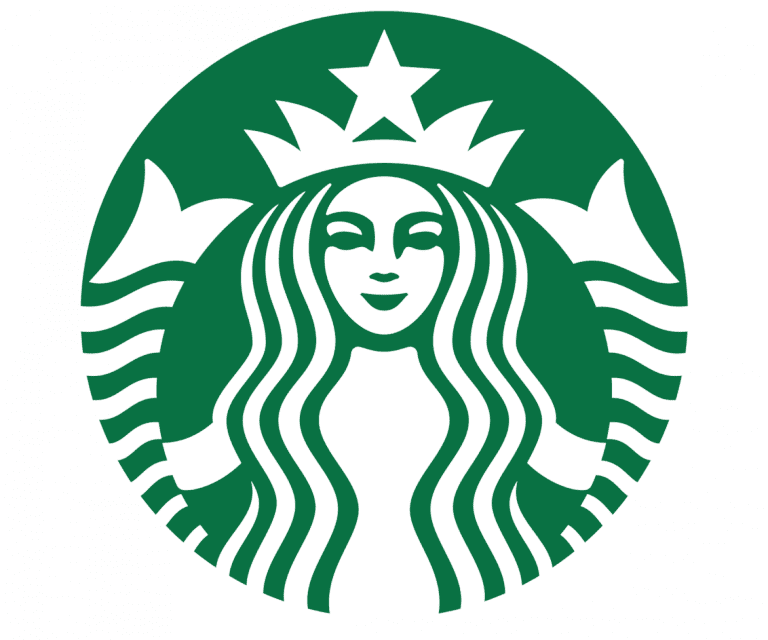

<div align="center">
  
</div>

# Ganyang Lapar di Gelap Nyawang
Ganyang Lapar di Gelap Nyawang adalah website yang berupa platform direktori UMKM yang membantu mahasiswa dan masyarakat menemukan tempat makan, kafe, dan layanan sekitar kawasan Gelap Nyawang. Dengan tampilan yang intuitif, pencarian cepat, kategori lengkap, serta galeri visual, platform ini mempermudah pengguna menemukan lokasi terbaik sesuai kebutuhan mereka.

<a name="readme-top"></a>

<!-- PROJECT LOGO -->
<div align="center">
  
  <p><strong>Jelajahi Rasa, Nikmati Suasana</strong></p>
</div>

<div align="center">
  <h3>Made by:</h3>
  <p><strong>Riantama Putra</strong> – Web Developer & Project Integrator</p>
  <p><strong>Aldyto Rafif Abhinaya</strong> – Detail Page & Konten</p>
  <p><strong>Muhammad Ghiffary Alfathan</strong> – Direktori Page & Data</p>
  <br />
  <a href="https://github.com/veinsan/GelapNyawang"><strong>Explore the docs »</strong></a>
  <br /><br />
</div>

---

### 🎯 Tujuan & Manfaat

Proyek ini dibuat untuk membantu UMKM di kawasan Gelap Nyawang agar lebih mudah ditemukan oleh mahasiswa, warga sekitar, dan wisatawan.  
Selain menjadi direktori kuliner interaktif, website ini juga menjadi media promosi gratis yang membantu usaha lokal meningkatkan visibilitas di dunia digital.

---

### 🛠️ Teknologi yang Digunakan

<div align="center">


</div>

<br>

| Teknologi | Deskripsi | Peran dalam Project |
|-----------|-----------|---------------------|
| **Next.js 14** | Framework React modern | Routing, modularisasi halaman, optimasi performa & SEO |
| **Tailwind CSS** | Utility-first CSS | Styling responsif, cepat, dan konsisten |
| **Framer Motion** | Library animasi | Transisi smooth, scroll, parallax & hover |
| **Lucide React** | Set ikon ringan | Ikon navigasi, tombol, dan dark mode toggle |
| **Intersection Observer** | Browser API | Deteksi elemen saat on-screen untuk animasi |

---

### 🚀 Fitur Teknologi

- **Responsive Design** – Optimal dari mobile sampai desktop  
- **Dark/Light Mode** – Transisi tema dengan animasi ikon  
- **Live Search & Filter** – Cari UMKM secara real-time  
- **Komponen Modular** – Struktur jelas & mudah dikembangkan  
- **Framer Motion Effects** – Hero animation, fade-up, parallax, marquee testimoni  
- **Interactive Directory** – Kategori, trending, galeri, dan detail UMKM  
- **SEO Optimized** – Memanfaatkan struktur bawaan Next.js  

---

## ⭐ Fitur Unggulan

- 🍜 **Trending UMKM** – Menampilkan tempat makan yang paling sering dicari  
- 🔎 **Pencarian Cepat** – Langsung muncul hasilnya tanpa reload  
- 📂 **Filter Kategori** – Pilih makanan, minuman, atau cemilan  
- 🗺️ **Detail UMKM** – Foto, rating, harga, deskripsi, dan Google Maps  
- 📸 **Galeri** – Foto suasana Gelap Nyawang  
- 🌙 **Dark Mode** – Transisi tema yang halus dan nyaman dilihat  

---

## 🧩 Struktur Halaman

1. **Halaman Utama (`/`)**
   - Hero  
   - Tentang  
   - Trending  
   - Testimoni  
   - Galeri  
   - Lokasi  

2. **Halaman Direktori (`/direktori`)**
   - Pencarian  
   - Filter kategori  
   - Grid UMKM  

3. **Halaman Detail (`/direktori/[slug]`)**
   - Header foto  
   - Rating, harga, kategori  
   - Galeri  
   - Informasi lengkap  
   - Google Maps 

---

## 📦 Instalasi

1. **Clone repository**
    ```bash
    git clone https://github.com/veinsan/GelapNyawang.git
    ```

2. **Masuk ke direktori project**
    ```bash
    cd gelap-nyawang
    ```

3. **Install dependencies**
    ```bash
    npm install
    ```

4. **Jalankan development server**
    ```bash
    npm run dev
    ```

5. **Buka di browser**
    ```bash
    http://localhost:3000
    ```

---

## Cara Menjalankan

Website berjalan di atas Next.js. Cukup jalankan:

```bash
npm run dev
```
Website akan terbuka di localhost:3000.


---

## 👥 Kontribusi Kelompok

| Nama | Peran | Kontribusi |
|------|-------|------------|
| **Riantama Putra** | Web Developer & Integrator | Mengerjakan seluruh **main page** dari awal sampai akhir (hero, banner, tentang, rekomendasi, galeri, testimoni, lokasi, footer). Membuat dan menyusun **data UMKM**, membangun **halaman direktori**, serta mengarahkan alur pengerjaan proyek secara keseluruhan. |
| **Aldyto Rafif Abhinaya** | Riset, Detail Page & Konten | Membuat **detail page versi pertama**, membuat **thumbnail karya**, serta membantu memasukkan data UMKM ke dalam `umkmData.js`. |
| **Muhammad Ghiffary Alfathan** | Direktori Page, Detail Page & Data | Membantu mengerjakan **halaman direktori**, merapikan dan menyelesaikan **detail page**, serta membantu memasukkan data UMKM ke dalam `umkmData.js`. |


---

### 🌐 Live Demo

🔗 **https://gelap-nyawang.vercel.app**

---

<p align="right">(<a href="#readme-top">back to top</a>)</p>